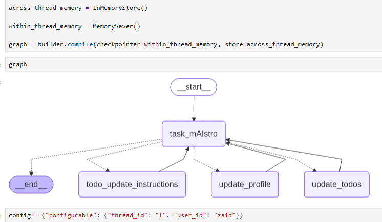

# 17.-task_mAistro

🧠 Project Overview:
I’m excited to introduce task_mAIstro, an AI-powered assistant designed to intelligently handle user profile updates, manage to-do tasks, and follow customized user instructions — all through natural conversations. 

🎯 Core Functionalities:
1️⃣ Profile Management – Update and manage user profile information directly through conversation.

2️⃣ Smart Task Management – Add to-do tasks that not only get stored but also follow the personalized instructions defined in the database.

3️⃣ Instruction Updates – Seamlessly update and modify task-handling instructions in the database just by talking to the chatbot.

4️⃣ Information Retrieval – Ask the chatbot about your personal profile details or pending to-do tasks, and it will fetch and display them directly from the database.

All of this can be done just by chatting with task_mAIstro — ensuring 100% efficiency and simplicity in managing your tasks and personal data.

📈 Impact & Use Cases:
From boosting personal productivity to serving as an intelligent assistant for organizations, task_mAIstro demonstrates how conversational AI can revolutionize the way we manage our daily responsibilities.

📌 Tech Stack:
LangGraph | LangChain | Hugging Face | Python | Streamlit | Machine Learning | Deep Learning | NLP
